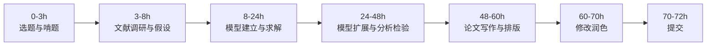

正式比赛全流程（以72小时竞赛为例）

下图是完整流程，可以保存下来当作任务看板：

下面逐个步骤拆解。

### 阶段一：选题与问题重述（0～3小时）

#### 1. 选题决策
**目的**：用最短时间选定最适合本队的题目，避免中途换题浪费时间。  
**具体动作**：
- 三人各自速读所有题目，标记关键词（优化、预测、评价、物理机理等）。
- 讨论每道题的**已知条件、求解目标、数据量大小**，判断该题是“重推导”还是“重数据”，能否与队伍技能匹配。
- 若某题已有初步思路、能快速找到参考文献，优先选择。
- 果断放弃“看起来有趣但完全不懂”的题。

**主要产出**：确定的**选题编号 + 初步判断记录**（题属哪类模型，难点在哪）。

#### 2. 问题重述与分析
**目的**：把题目语言转化为数学语言，界定清楚“输入是什么，输出是什么，约束是什么”。  
**具体动作**：
- 逐字逐句拆解题目，划出所有**需要计算的具体数值、需要绘制的图表、需要回答的问题**。
- 把题目拆分成若干个子问题（通常题目本身就分小问），分析每一问的已知量、决策变量、目标函数、约束条件。
- 用一句话概括每问核心：“这一问本质是一个 XX 模型/问题”。

**主要产出**：
- **问题拆解思维导图或清单**（贴在桌面/共享文档里）
- 全队对题目理解达成一致

### 阶段二：文献调研与合理假设（3～8小时）

#### 1. 文献快速调研
**目的**：站在前人肩膀上，找到可借鉴的模型、算法和参数，避免从零发明轮子。  
**具体动作**：
- 根据关键词在知网、IEEE Xplore、百度学术搜索，优先找中文硕博论文、综述文章、相近题目论文。
- 快速扫读摘要和模型公式，提取**可以直接用的数学模型、经验公式、常数参数**。
- 把参考文献的模型核心思想记录到共享笔记，标注来源。

**主要产出**：
- **参考文献列表**（10篇左右高质量文献）
- **可借用模型/参数清单**

#### 2. 模型假设与符号说明
**目的**：合理简化现实，使问题可解，同时给论文“严谨性”加分。  
**具体动作**：
- 列出题目中的理想化前提（忽略次要损耗、假设系统稳态、负荷均匀等）。
- 每条假设必须对应一个**合理性解释**，不能凭空捏造。
- 统一全书符号：用表格列出所有变量、参数、下标含义和单位。

**主要产出**：
- **假设条目 + 理由**
- **符号说明表**（可直接放进论文）

### 阶段三：模型建立与求解（8～24小时，最核心阶段）

#### 1. 第一问建模与求解
**目的**：快速做出一个可运行的基线模型，实现“从零到有”的突破。  
**具体动作**：
- 针对第一问，写出**数学表达式**（目标函数、约束、微分方程、统计关系等），不要只写代码，先要在纸上/文档里公式化。
- 用最简单的数值方法求解（线性规划用库函数，微分方程用ode45/solve_ivp，拟合用最小二乘等）。
- 得出初步数值结果，立即用常识检验（数量级是否离谱、趋势是否合理）。

**主要产出**：
- 第一问的**完整数学模型（公式）**
- **可运行代码 + 初步数值结果**
- 结果合理性初步验证

#### 2. 逐问推进，螺旋式深化
**目的**：以前一问为基础，逐步增加模型复杂度，保证每一问结果都能写进论文。  
**具体动作**：
- 把前一问的代码模块化，方便后续问调用。
- 每推进一问，先判断是“参数改动”还是“模型升级”。若是后者，重新走“公式推导 → 编码 → 验证”流程。
- 所有中间结果、调参过程用注释或日志保存，方便写作时回溯。

**主要产出**：
- 各问的**模型公式、代码、结果文件**
- 关键图表草稿（曲线、对比表、热力图等）

### 阶段四：模型分析与检验（24～48小时）

#### 1. 误差分析与模型检验
**目的**：证明你的模型可靠、结果可信，是拿奖的硬指标。  
**具体动作**：
- 如果有真实值或题目给的部分数据，做**误差分析**（计算MAPE、RMSE等），并用表格或误差带图展示。
- 进行**灵敏度分析**：轻微改变关键参数（±5%、±10%），观察输出变化，画出龙卷风图或灵敏度曲线。
- 进行**稳定性/收敛性检验**：改变网格剖分、时间步长，观察结果是否收敛。
- 若有条件，与文献结果或常规方法做对比。

**主要产出**：
- 误差统计表
- 灵敏度分析图/表
- 稳定性检验结果及结论

#### 2. 模型评价与改进方向
**目的**：向评委展示你清楚模型的优缺点，展现学术素养。  
**具体动作**：
- 总结模型优点（简洁、物理意义清晰、计算高效等），每条优点对应一个具体表现。
- 客观指出缺点（忽略了某非线性、数据不足、仅适用于稳态等）。
- 给出可操作的改进方向（如“引入实时电价预测模块”“考虑用户行为不确定性”）。

**主要产出**：
- 优点清单 + 缺点清单 + 改进建议段落的草稿

### 阶段五：论文写作与排版（48～60小时）

**目的**：把前面所有的技术工作翻译成一篇逻辑严密、图文并茂、评委爱读的论文。  
**具体动作**：
- **先写摘要**（反复打磨！）：涵盖“问题背景 → 所用模型方法 → 关键结果 → 结论亮点”，字数控制严格，每一句都是得分点。
- 按标准结构填充内容：问题重述、假设与符号、模型建立、模型求解、结果分析、模型检验、评价与推广。
- 生成最终版图表：高分辨率，统一字体大小，配色协调，标题和坐标轴标签完整。
- 排版时注意公式编号右对齐，图表标题在表上图下，引用文献格式统一。

**主要产出**：
- 论文初稿（所有章节完整）
- 高质量图表文件夹
- 初版摘要（供队员反复朗读修改）

### 阶段六：修改、润色与提交（60～72小时）

**目的**：消除低级错误，提升可读性，确保按时成功提交。  
**具体动作**：
- 至少两人交叉通读全文，检查：错别字、语法、公式编号引用、图表引用是否正确。
- 重点检查**数据与图表中的数值是否前后一致**（文中描述、表格、图片三者对得上）。
- 由写作最好的队员专门打磨摘要和结论，让读起来“有亮点、有数据、有自信”。
- 技术队员再次运行全部代码，确认结果可复现，且与论文中一致。
- 按竞赛官网要求，压缩打包论文、附件、代码，提前至少2小时提交，并下载确认文件无损坏。

**主要产出**：
- 最终版论文（PDF）
- 支撑材料压缩包（代码、数据、附加结果）
- 提交成功的截图/确认邮件

